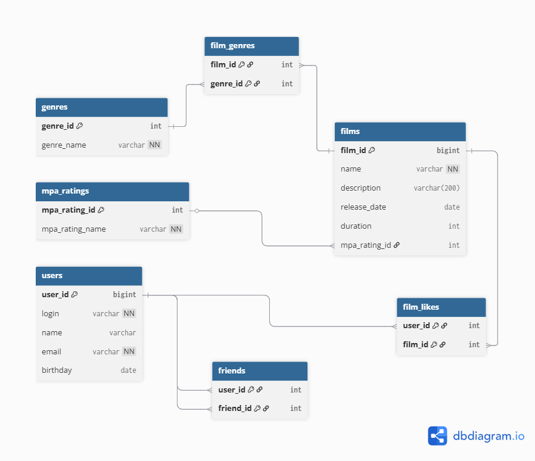

# java-filmorate
Template repository for Filmorate project.




**1. Поиск фильмов по названию**
```
SELECT name, description, release_date 
FROM films 
WHERE name LIKE '%любовь%';
```

**2. Топ-5 самых популярных фильмов**
```
SELECT f.name, COUNT(fl.user_id) as likes_count
FROM films f
LEFT JOIN film_likes fl ON f.film_id = fl.film_id
GROUP BY f.film_id, f.name
ORDER BY likes_count DESC
LIMIT 5;
```

**3. Получить все жанры фильма**
```
SELECT g.name
FROM film_genres f
JOIN genres g ON f.genre_id = g.id
WHERE f.film_id = 10;
```